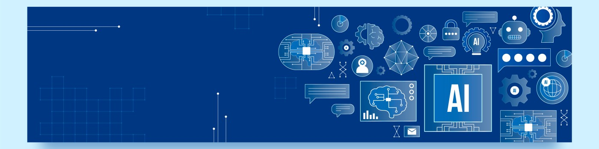

  
# About Me  

Hello! I'm **Glenn Claes**, a 21-year-old **Computer Science student** at **[PXL University of Applied Sciences and Arts](https://www.pxl.be/departementen/pxl-digital/toegepaste-informatica/artificiele-intelligentie/)** in Hasselt, Belgium, specializing in **Artificial Intelligence**.

I'm passionate about exploring the potential of **AI** and creating projects that showcase its capabilities. My experience spans both **full-stack development** and **AI-driven applications**, giving me a versatile skill set.

### 🔹 What I Do
- Develop full-stack applications using frameworks like **Spring Boot**, **ASP.NET Core**, **React**, and **Vue**.
- Build robust backend solutions with **FastAPI**, implement **CI/CD pipelines**, and leverage **Docker** for containerization.
- Utilize project management tools (**Jira, Confluence**) and follow **Scrum/Agile** methodologies to deliver efficient and organized workflows.
- Work with a variety of databases including **SQL, PostgreSQL, PL/SQL, and NoSQL**.
- Continuously expand expertise in **Machine Learning** and **Computer Vision** to create smarter, AI-powered applications.

### 🔹 Focus
- My main focus is on **integrating AI with modern web technologies** to develop **innovative and practical solutions**. I aim to leverage AI to **enhance application functionality, improve user experience, and provide smarter, more personalized services** within apps, delivering real-world impact and value.

---

  
# Connect with Me  

 
 
 
 

---

# Tech Stack  

### 🔹 Programming Languages  
  
 
 
  
 
 
 
 
 

### 🔹 Frameworks & Libraries  
 
 
  
 
 
  
 
  
 
 
 
 
 

### 🔹 Databases  
 
 
 
 

### 🔹 AI / Data Science  
 
 
 
  
 
 

### 🔹 DevOps & Cloud  
 
  
 
 
 

### 🔹 Tools & Platforms  
 
 
 
  
 
 
  
 
 
 

---

# Featured Projects  

### BuurtConnect
A production-ready full-stack **Java (Spring Boot) + React (Vite + TypeScript)** application for **neighborhood alerts, requests, and community help**.

**Tech & Features:**
- **CI/CD:** GitHub Actions
- **Containerization:** Docker
- **Orchestration:** Kubernetes (Helm charts)
- **Infrastructure as Code:** Terraform skeleton
- **Database Migrations:** Flyway
- **Observability & Security:** Integrated monitoring, logging, and security tooling
- **Developer-Friendly:** Modern workflows and developer tools

🔗 [BuurtConnect GitHub Repository](https://github.com/GlennClaes/BuurtConnect)

<!-- 
### 🚗 AI & ML: TrafficGuard  
AI-based license plate & vehicle detection system.  
**Tech:** Python, PyTorch, OpenCV, FastAPI  
🔗 [TrafficGuard](https://github.com/GlennClaes/TrafficGuard)  

---

### 👁️ Computer Vision App  
Face, hand & age detection using pre-trained models.  
**Tech:** Python, OpenCV, PyTorch  
🔗 [VisionDetectionApp](https://github.com/GlennClaes/VisionDetectionApp)  

---

### 🌍 Full-Stack Portfolio  
Personal portfolio built with Vue.js & FastAPI backend.  
**Tech:** Vue.js, FastAPI, Docker  
🔗 [portfolio-glenn-claes](https://github.com/GlennClaes/portfolio-glenn-claes)  

---

### 📊 UI Dashboard  
Modern analytics dashboard for e-commerce.  
**Tech:** React, TailwindCSS  
🔗 [ecommerce-dashboard-ui](https://github.com/GlennClaes/ecommerce-dashboard-ui)  
-->

---

# GitHub Analytics  

  
  
  

## GitHub Trophies  
  

---

  

